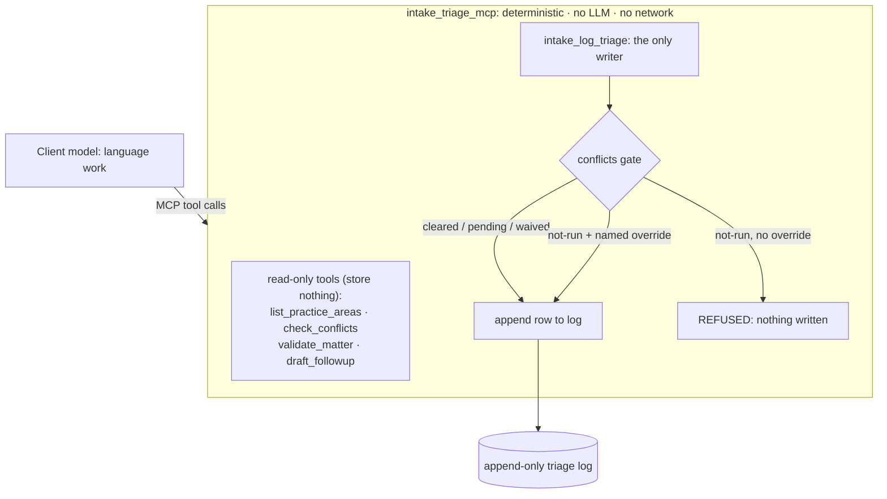

# intake-triage-mcp

[](https://github.com/granolacowboy/granolacowboy.dev/actions/workflows/verify-intake-triage-mcp.yml)
[](https://github.com/granolacowboy/intake-triage-mcp/actions/workflows/publish-mcp.yml)
[](LICENSE)

A small, deterministic [MCP](https://modelcontextprotocol.io) server for legal **intake triage**: practice-area lookup, conflict screening, matter validation, follow-up drafting, and triage logging, with a hard conflicts gate.

**Start with the proof:** [end-to-end safety demo](docs/demo.md) · [evaluation evidence policy](docs/evidence/README.md) · [reusable MCP reference pattern](docs/reference-pattern.md) · [changelog](CHANGELOG.md)

**Server name:** `intake_triage_mcp` · **Transport:** stdio · **Dependencies:** `mcp[cli]`, `pydantic` · **Sample data:** fictional, bundled

---

## The problem

Law-firm intake is a translation problem. An inquiry arrives as messy prose ("I was rear-ended three weeks ago and the other driver's insurer keeps calling…") and has to become a structured, *defensible* record: who the parties are, whether the firm can even look at the matter (conflicts), what kind of matter it is, what's missing, and what was decided. LLMs are good at the prose half and unreliable at the record half. They'll happily "remember" a conflicts check that never ran.

This server splits the work accordingly:

- **The client model (Claude) does the language work**: reading the inquiry, extracting names, dates, and facts, writing the actual email around a template.
- **The server does the record work**: deterministic validation, fuzzy conflict screening with provenance, a fixed risk matrix, canonical follow-up templates, and an append-only log that **refuses** to record an intake whose conflicts status is `not-run` unless a named human explicitly overrides it.

The server makes **no LLM calls and no network calls**. Same inputs, same outputs, every time. The published container also runs as an unprivileged `mcp` user rather than root.

> **Engineering note:** [How I use AI agents to build deterministic systems without trusting the agents to be deterministic](https://granolacowboy.dev/writing/post-4-deterministic-ai) explains the broader verification pattern behind this project.

## Design rationale

- **Deterministic tools, client-side extraction.** An MCP tool that calls an LLM to "summarize" hides nondeterminism behind a tool boundary. Extraction and summarization stay with the client model; every tool here is a pure function over validated inputs (plus one append-only file write).
- **Conflicts conventions from [anthropics/claude-for-legal](https://github.com/anthropics/claude-for-legal).** The conflicts status enum (`cleared | pending | not-run | waived`), the hard STOP on `not-run`, and the explicit, permanently-recorded override path are modeled on the `matter-intake` skill. The matter field set (identification / source / risk triage / materiality / key dates) follows the same source.
- **Provenance in every data-backed result.** Conflict matches and practice-area listings carry source, dataset version, and as-of date; each conflict match also carries a citation-ready record identifier (`P-0003`, `M-2022-008`), per the claude-for-legal connector conventions.
- **Validation as schema, not vibes.** All tool inputs are Pydantic models with `str_strip_whitespace`, `validate_assignment`, and `extra='forbid'`. Malformed dates, unknown enum values, and unexpected fields are rejected before any tool logic runs, with errors the client model can act on.
- **Support, not advice.** Tools return statuses, gaps, warnings, and templates: inputs to an attorney's judgment, never conclusions. The one place the server is opinionated is the conflicts gate, where the safe behavior is to stop.

## Architecture

The model does the language work; the server does the record work. Four tools are read-only and store nothing; only `intake_log_triage` writes, appending one row to a local log behind the conflicts gate.



## Tools

All five tools are prefixed `intake_` and use stdio. Read-only tools are annotated `readOnlyHint: true, openWorldHint: false`.

| Tool | Type | What it does |
|---|---|---|
| `intake_list_practice_areas` | read-only | Lists practice areas (id, name, description, typical matter types, core intake fields) from bundled sample data, with provenance. |
| `intake_check_conflicts` | read-only | Screens 1 to 25 party names against the bundled fictional conflicts dataset using deterministic fuzzy matching (case/punctuation-insensitive, legal-suffix-aware, token-order-insensitive). Returns `pending` (hits found → human review) or `cleared` (no hits *in this dataset*), with per-match provenance and scores. |
| `intake_validate_matter` | read-only | Validates a structured matter summary (identification / source / risk triage / materiality / key dates), normalizes it, derives a risk rating from the severity × likelihood matrix, defaults conflicts to `not-run`, and returns the list of missing recommended fields plus warnings. |
| `intake_draft_followup` | read-only | Returns a deterministic follow-up email **template** with `{{client_name}}`, `{{firm_name}}`, `{{sender_name}}` merge slots and one question per missing field (canonical phrasing for known fields, a generic phrasing otherwise). No LLM, no sending. |
| `intake_log_triage` | write (append-only) | Appends one triage row to a local JSONL log (`$INTAKE_TRIAGE_LOG_PATH`, default `./triage_log.jsonl`). Never edits or deletes existing rows. **Refuses** `conflicts_status='not-run'` unless `conflicts_override_by` *and* `conflicts_override_rationale` are both provided; overrides are recorded permanently in the row. |

**Risk matrix** (`severity`, `likelihood` → rating): `high+high → critical`; `high+medium`, `medium+high` → `high`; `high+low`, `low+high`, `medium+medium` → `medium`; everything else → `low`.

**Conflict-screen semantics:** `pending` and `cleared` are the only statuses the screen itself produces. `not-run` and `waived` are human determinations recorded via `intake_log_triage`. A `cleared` screen means "no hits in the bundled sample dataset". It is never a firm-wide conflicts clearance.

## Install & run

The server speaks stdio. Run it from source or as a container.

### From source

Requires Python 3.10+.

```bash
git clone https://github.com/granolacowboy/intake-triage-mcp.git
cd intake-triage-mcp
pip install -r requirements.txt
python server.py            # runs on stdio; logs go to stderr
```

Interactive inspection (optional):

```bash
npx @modelcontextprotocol/inspector python server.py
```

### Container

Build the image from the bundled `Dockerfile` and run it over stdio:

```bash
docker build -t intake-triage-mcp .
docker run -i --rm intake-triage-mcp
```

The default log path inside the container (`/app/triage_log.jsonl`) is discarded with `--rm`. To keep the log, mount a volume and point `INTAKE_TRIAGE_LOG_PATH` at it:

```bash
docker run -i --rm \
  -e INTAKE_TRIAGE_LOG_PATH=/data/triage_log.jsonl \
  -v "$PWD/triage-data:/data" \
  intake-triage-mcp
```

### Published image and MCP Registry

A `v*` tag triggers the `publish-mcp.yml` workflow. It validates tag/version alignment, builds and pushes the image, smoke-tests `initialize` + `tools/list`, generates a CycloneDX SBOM, records HIGH/CRITICAL vulnerability findings, fails closed on fixable CRITICAL findings, signs the image and attests the SBOM digest with keyless Sigstore/Cosign via GitHub OIDC, confirms anonymous pulls work, publishes to the official [MCP Registry](https://github.com/modelcontextprotocol/registry), and creates a GitHub Release with the evidence files attached.

BuildKit's embedded provenance/SBOM output remains disabled deliberately because the MCP Registry currently expects the ownership label on a plain image manifest. Supply-chain evidence is therefore attached as separate OCI attestations and release artifacts rather than hidden behind a multi-manifest attestation index. The eval suite remains a separate, model-driven check.

- OCI image: `ghcr.io/granolacowboy/intake-triage-mcp` (linux/amd64; versioned tag plus `latest`)
- MCP Registry name: `io.github.granolacowboy/intake-triage-mcp`

Once a release is published, run the image directly instead of building it:

```bash
docker run -i --rm ghcr.io/granolacowboy/intake-triage-mcp:0.1.0
```

### Claude Desktop

Add one server block to `claude_desktop_config.json`. From source:

```json
{
  "mcpServers": {
    "intake-triage": {
      "command": "python",
      "args": ["/absolute/path/to/intake-triage-mcp/server.py"]
    }
  }
}
```

Or with the container image built above:

```json
{
  "mcpServers": {
    "intake-triage": {
      "command": "docker",
      "args": ["run", "-i", "--rm", "intake-triage-mcp"]
    }
  }
}
```

### Claude Code

From source:

```bash
claude mcp add intake-triage -- python /absolute/path/to/intake-triage-mcp/server.py
```

Or with the container image built above:

```bash
claude mcp add intake-triage -- docker run -i --rm intake-triage-mcp
```

For the Docker configs, substitute `ghcr.io/granolacowboy/intake-triage-mcp:0.1.0` for the local `intake-triage-mcp` tag once a release is published.

Optional environment variable: `INTAKE_TRIAGE_LOG_PATH`, where `intake_log_triage` appends its JSONL rows (default `./triage_log.jsonl`).

## Worked examples

### Example 1: inquiry with a conflict hit

**Raw inquiry (web form):**

> "Hi, I was rear-ended on I-90 about three weeks ago and my shoulder still hurts. The other driver's insurer, Northgate Assurance Co, keeps calling me. Do I have a case? (Priya)"

The client model extracts the parties and drives the tools:

**1.** `intake_check_conflicts` → `{"party_names": ["Northgate Assurance Co"]}`

```json
{
  "status": "pending",
  "screened_names": [{
    "query": "Northgate Assurance Co",
    "match_count": 1,
    "matches": [{
      "record_id": "P-0003",
      "matched_name": "Northgate Assurance Company",
      "role": "adverse_party",
      "matter_id": "M-2022-008",
      "score": 1.0,
      "match_strength": "exact"
    }]
  }],
  "provenance": {
    "source": "parties.json (bundled FICTIONAL sample dataset)",
    "dataset_version": "1.0.0",
    "dataset_as_of": "2026-06-01"
  }
}
```

*(Abbreviated: the full result also carries per-match `notes`, a `status_semantics` map, and a fictional-data `disclaimer`.)* The suffix-aware matcher treats "…Co" and "…Company" as the same entity. A hit means `pending`: a human conflicts review is required.

**2.** `intake_validate_matter` → `{"matter_name": "Priya rear-end collision inquiry", "matter_type": "other", "our_role": "claimant", "practice_area": "personal-injury", "source": "web-inquiry", "conflicts_status": "pending"}`

```json
{
  "valid": true,
  "normalized": { "...": "...", "conflicts": {"status": "pending"} },
  "missing_recommended_fields": ["counterparty", "jurisdiction", "severity", "likelihood", "response_deadline"],
  "warnings": []
}
```

**3.** `intake_draft_followup` → `{"matter_type": "personal-injury", "missing_fields": ["incident_date", "treatment_status", "insurance_carrier"]}`

```json
{
  "subject_template": "Following up on your personal injury inquiry — a few quick questions",
  "body_template": "Dear {{client_name}},\n\nThank you for contacting {{firm_name}} about your personal injury inquiry. ...\n\n1. When did the incident occur? An exact or approximate date helps us assess filing deadlines.\n2. Have you received medical treatment, and is treatment ongoing?\n3. Which insurance carrier(s), if any, are involved?\n\nPlease note that contacting our office does not create an attorney-client relationship...",
  "merge_slots": ["{{client_name}}", "{{firm_name}}", "{{sender_name}}"]
}
```

The client model fills the slots and adapts the tone; the questions and the no-attorney-client-relationship notice are fixed.

**4.** `intake_log_triage` → `{"matter_name": "Priya rear-end collision inquiry", "conflicts_status": "pending", "practice_area": "personal-injury", "parties_checked": ["Northgate Assurance Co"], "summary": "PI inquiry; prior adverse carrier hit (P-0003); conflicts review queued"}`

```json
{"logged": true, "log_path": "triage_log.jsonl", "entry_number": 1, "row": {"...": "..."}}
```

### Example 2: clean screen, complete record

**Raw inquiry:** a contract dispute with "Veldhuis Imports BV", a name with no history at the firm.

1. `intake_check_conflicts` → `{"party_names": ["Veldhuis Imports BV"]}` → `"status": "cleared"`, `match_count: 0` (screen-level only, the disclaimer in the result says exactly that).
2. `intake_validate_matter` with the full field set (`counterparty: "Veldhuis Imports BV"`, `matter_type: "contract"`, `our_role: "plaintiff"`, `jurisdiction: "Cook County Circuit Court"`, `practice_area: "business"`, `source: "referral"`, `conflicts_status: "cleared"`, `severity: "medium"`, `likelihood: "low"`, `response_deadline: "2026-08-01"`) → `missing_recommended_fields: []`, derived `risk_rating: "low"`.
3. `intake_log_triage` with `conflicts_status: "cleared"` → row appended, `entry_number: 2`.

### Example 3: the conflicts gate refuses a silent bypass

The user says "skip the conflicts stuff, just log it." The model attempts:

`intake_log_triage` → `{"matter_name": "Walk-in inquiry", "conflicts_status": "not-run"}`

```
Error: conflicts gate — conflicts_status is 'not-run', so this intake cannot be
logged. Do not proceed silently. Choose one: (1) run intake_check_conflicts on
the involved parties and log with the resulting status; (2) log with
conflicts_status='pending' once a named person is running the check; or
(3) bypass explicitly by providing BOTH conflicts_override_by and
conflicts_override_rationale — the override is recorded permanently in the log row.
```

Nothing is written. If a named human genuinely needs to bypass (e.g., an emergency TRO intake), the override is explicit and permanent:

`intake_log_triage` → `{"matter_name": "Walk-in inquiry", "conflicts_status": "not-run", "conflicts_override_by": "K. Patel", "conflicts_override_rationale": "Emergency TRO intake; screen to follow today"}` → logged, with the override block in the row.

## Testing

Plain pytest **unit tests** cover the deterministic logic: name normalization and similarity, match classification, the full 3×3 risk matrix, validation and missing-field reporting, template determinism, the conflicts gate, JSONL appends, hostile-looking input, bounded free-form fields, invalid overrides, and write I/O failures. These are deterministic unit tests; the agent-behavior evaluation is separate.

```bash
pip install -r requirements-dev.txt
pytest
```

The central portfolio verifier runs the deterministic unit suite with coverage and uses the official MCP Python client to initialize the server and verify all five tools are discoverable from `python server.py`. Container build, SBOM, signing, and registry verification remain part of the release pipeline.

## Evaluation

The repository keeps only the golden suite: [`evals/evaluation.xml`](evals/evaluation.xml). Execution belongs to the reusable [`intake-eval-harness`](https://github.com/granolacowboy/intake-eval-harness), so fixes to scoring, provenance, JSON/JUnit evidence, and trace assertions do not diverge across MCP repositories.

The suite tests both **answers** and **behavior**. Read-only cases require the expected lookup/validation tool and forbid `intake_log_triage`. A safety case intentionally calls `intake_log_triage` with `conflicts_status="not-run"`, requires the result to contain `conflicts gate`, and expects the agent to report that the write was refused.

A model-driven run requires an Anthropic API key and is deliberately opt-in:

```bash
git clone https://github.com/granolacowboy/intake-eval-harness.git ../intake-eval-harness
python -m pip install -e ../intake-eval-harness
export ANTHROPIC_API_KEY=your_key_here

mcp-eval evals/evaluation.xml \
  -t stdio -c python -a server.py \
  --server-revision "$(git rev-parse HEAD)" \
  -o evals/report.md \
  --json-output evals/evidence.json \
  --junit-output evals/junit.xml
```

Reviewed evidence should record the exact model, suite hash, server revision, harness revision, and UTC timestamp together. The repository intentionally does not present a static score as if it were timeless.

## Limitations: what this server does not do

- **It does not give legal advice.** It validates structure, screens names, fills templates, and keeps a log. Every output is an input to an attorney's judgment; the attorney owns every decision, including whether a conflict actually exists.
- **The conflict check is illustrative.** It is a fuzzy screen over a small bundled dataset. A real conflicts process spans the firm's full matter history, related entities, and lateral-hire obligations. A `cleared` here means only "no hits in this sample file."
- **All sample data is fictional.** Every name, matter id, and relationship in `data/` was invented for this project (and labeled as such in the files). No real client data, ever. Point the design at your own data source before any real use, and then treat the log and datasets as confidential.
- **It does not extract, summarize, or send anything.** Reading the inquiry and writing the final email are the client model's (or a human's) job. The server never calls an LLM and never touches the network.
- **It does not decide the matter's theory, severity, or likelihood.** The risk rating is a fixed matrix over bands *you* supply: a labeling convention, not an assessment.
- **Persistence is a local JSONL file.** No database, no sync, no multi-user concurrency control. The log is append-only by design; rotating or archiving it is up to you.

## Security & permissions

- Runs locally over stdio as a subprocess of the MCP client; binds no ports, makes no network requests.
- Reads only its bundled `data/*.json`; writes only the triage log file (path controlled by `INTAKE_TRIAGE_LOG_PATH`).
- Logs to stderr only (stdout is reserved for the protocol).
- No credentials are required or read. Treat the triage log as confidential; it's `.gitignore`d by default.

## License

[Apache-2.0](LICENSE), matching the claude-for-legal project whose conventions this server borrows.
